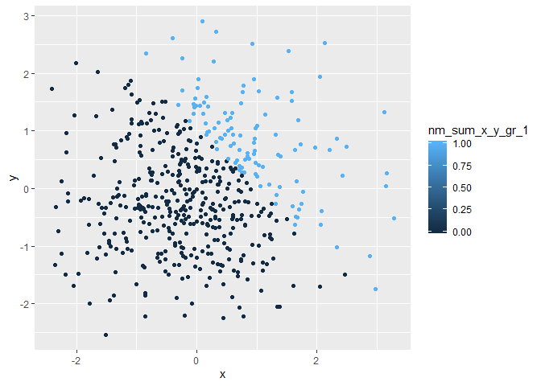
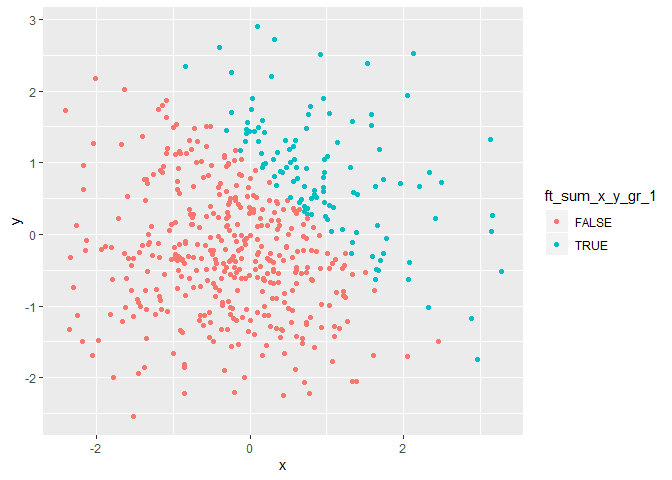

p8105\_hw1\_jfh2150
================
Ford Holland

## Problem 1

The following code creates a data frame comprised of:

  - a random sample of size 8 from a standard Normal distribution
  - a logical vector indicating whether elements of the sample are
    greater than 0
  - a character vector of length 8
  - a factor vector of length 8, with 3 different factor levels (“low”,
    “medium”, and “high”)

Taking the mean of each column via the `map` function from the `purrr`
package demonstrates that the `mean` function in R coerces logical, but
not character or factor, vectors to numeric.

The mean is successfully calculated for the numeric variable and the
logical variable, which is coerced to values of `1` and `0` for `TRUE`
and `FALSE`, respectively. `NA` values are returned for the character
and factor variables.

``` r
# create data frame
df_problem_1 = tibble(
  nm_random_sample = rnorm(8),
  lg_sample_gr_0 = as.logical(nm_random_sample > 0),
  ch_vector = as.character(1:8),
  ft_vector = factor(
    rep(c("high", "medium", "low"), length.out = 8),
    levels = c("low", "medium", "high")
  )
)

# take mean of each column
df_problem_1 %>% 
  map(mean)
```

    ## Warning in mean.default(.x[[i]], ...): argument is not numeric or logical:
    ## returning NA
    
    ## Warning in mean.default(.x[[i]], ...): argument is not numeric or logical:
    ## returning NA

    ## $nm_random_sample
    ## [1] -0.4076949
    ## 
    ## $lg_sample_gr_0
    ## [1] 0.375
    ## 
    ## $ch_vector
    ## [1] NA
    ## 
    ## $ft_vector
    ## [1] NA

Applying the `as.numeric` function to the non-numeric variables in the
data frame successfully converts all 3 vectors to numeric in my example.

The logical vector is converted to values of `1` and `0` as with the
`mean` function. In this example, the character vector was also
converted to numeric because of my choice of characters (`"1", "2", ...
,"8"`). Had this vector contained values like `"blue"` or `"one"` the
coercion would have failed, but characters that contain numbers can be
converted to numeric. Finally, the factor variable was also successfully
converted to numeric because of its underlying level structure. R treats
factor levels as numeric, so it is possible to convert the character
values to numbers according to their levels.

These results confirm a few findings from the mean calculations above.
Firstly, that logical values can be and are coerced to numeric by the
`mean` and `as.numeric` functions. And secondly, that although factors
and (in some cases) characters can be coerced to numeric, the `mean`
function does not perform these
conversions.

``` r
# map as.numeric function to the logical, character, and factor variables
df_problem_1 %>% 
  select(-c(nm_random_sample)) %>% 
  map(as.numeric)
```

The code chunk below further demonstrates how logical and factor data
types can be converted to numeric to apply arithmetic operations.
Examples (b) and (c) show that multiplication in R will not implicitly
coerce factors to numeric, but if they are explicitly cast, as in (c),
it is possible to perform multiplication and other operations on
factors.

``` r
# (a)
# convert the logical vector to numeric 
nm_converted_vector = df_problem_1 %>% 
  pull(lg_sample_gr_0) %>% 
  as.numeric() 

# pull the random sample
nm_random_sample = df_problem_1 %>% 
  pull(nm_random_sample)

# multiply the random sample by the result
nm_converted_vector * nm_random_sample
```

    ## [1] 0.0000000 0.0000000 0.6113358 0.9022784 0.0000000 0.0000000 0.0000000
    ## [8] 0.4529132

``` r
# (b)
# convert the logical vector to a factor
ft_converted_vector = df_problem_1 %>% 
  pull(lg_sample_gr_0) %>% 
  factor(levels = c(FALSE, TRUE)) 

# multiply the random sample by the result
ft_converted_vector * nm_random_sample
```

    ## Warning in Ops.factor(ft_converted_vector, nm_random_sample): '*' not
    ## meaningful for factors

    ## [1] NA NA NA NA NA NA NA NA

``` r
# (C)
# convert the logical vector to a factor and then convert the result to numeric
nm_reconverted_vector = ft_converted_vector %>% 
  as.numeric()

# multiply the random sample by the result
nm_reconverted_vector * nm_random_sample
```

    ## [1] -0.5251568 -0.6010842  1.2226717  1.8045568 -1.1303166 -0.6765596
    ## [7] -2.2949692  0.9058265

## Problem 2

``` r
df_problem_2 = tibble(
  x = rnorm(500),
  y = rnorm(500),
  lg_sum_x_y_gr_1 = as.logical(x + y > 1),
  nm_sum_x_y_gr_1 = as.numeric(lg_sum_x_y_gr_1),
  ft_sum_x_y_gr_1 = factor(lg_sum_x_y_gr_1, levels = c(FALSE, TRUE))
)
```

The data frame created above contains samples of length 500 from the
standard normal distribution (`x` and `y`), and three features
indicating whether `x + y > 1`. The first indicator is a logical vector,
and the second two were created by coercing that vector to numeric and
factor types.

The data frame is thus comprised of 500 rows and 5 columns. Column `x`
has a mean of -0.0591635, a median of -0.0343713, and standard deviation
of 1.0097052. The proportion of cases where `x + y > 1` is 0.222.

The scatterplots displayed below show `x` plotted against `y`. In each
plot, the points are colored by one of the three indicators.

The first plot is colored by the logical indicator. As such, the color
scale reflects the two discrete values (`TRUE` and `FALSE`) that the
indicator comprises.

``` r
# scatterplot colored by logical vector
ggplot(df_problem_2, aes(x = x, y = y, color = lg_sum_x_y_gr_1)) +
  geom_point()
```

<!-- -->

``` r
# save plot above
ggsave(filename = "scatterplot_by_lg_indicator.pdf")
```

    ## Saving 7 x 5 in image

The second plot is colored by the numeric indicator derived from the
logical indicator. Although the indicator only contains discrete values
of `1` and `0`, ggplot recognizes numeric features as continuous, so a
continuous color scale is displayed in the legend.

``` r
# scatterplot colored by numeric vector
ggplot(df_problem_2, aes(x = x, y = y, color = nm_sum_x_y_gr_1)) +
  geom_point()
```

<!-- -->

The final plot is colored by the factor indicator derived from the
logical indicator. As with the logical indicator, the color scale
contains only the two discrete factor values of `TRUE` and `FALSE`.

``` r
# scatterplot colored by factor vector
ggplot(df_problem_2, aes(x = x, y = y, color = ft_sum_x_y_gr_1)) +
  geom_point()
```

<!-- -->
